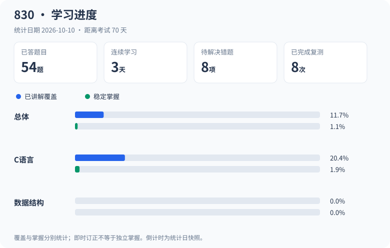
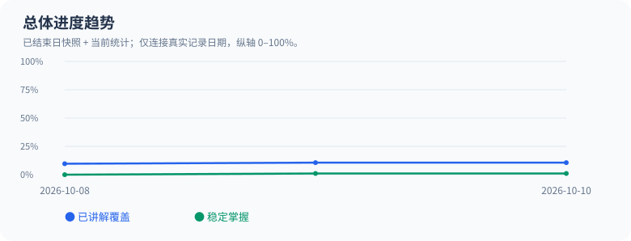

# 830 个人学习仓库

保留「讲解 → 出题 → 作答 → 批改 → 纠错 → 复测」流程。Python 小工具只负责保存、索引、恢复状态和展示反馈，不调用模型，不重新实现教学决策。

## 在 Ubuntu 电脑安装

代码和学习数据保存在 Git 仓库中。首次安装时运行：

```bash
cd ~
git clone https://github.com/Aotumanaotu/830.git 830
cd ~/830
python3 -m venv .venv
. .venv/bin/activate
pip install -r requirements.txt
python study.py start
python study.py context --compact
```

如果 `~/830` 已是此仓库，先保存本机改动，再运行 `git pull --ff-only`；如果目录已有其他资料，请先另选目录克隆，勿覆盖。

## 每次学习

- `python study.py start`：先展示面板，同一自然日只展示一次鼓励。
- `python study.py context --compact`：日常恢复用。完整当前题目、最多3项到期错因和最近一段小结，不默认加载讲义或检索；同会话同考点直接复用已读内容。
- `python study.py context`：新考点/疑点时展开当前知识、最多5项到期复习、最近2份日志及最多2400字符检索资料；不加载归档。
- `python study.py get answers A0001`：读取指定记录。复习过多时按ID继续读取，不把全部历史输入模型。
- `python study.py panel`：只看面板，不消耗当天鼓励。
- `python study.py close`：汇总当天、更新当天唯一快照和日志。不把打开面板自动算学习，也不编造时长。
- `python study.py check`：检查记录格式和关联。

## 学习进度

<!-- STUDY_PROGRESS_START -->
统计日期：**2026-10-10**（由学习记录生成；实时数据见 `python3 study.py panel`）。





<details>
<summary>查看精确数值与当前任务</summary>

| 范围 | 已讲解覆盖 | 稳定掌握 |
|---|---:|---:|
| 总体 | 11.7% | 1.1% |
| C语言 | 20.4% | 1.9% |
| 数据结构 | 0.0% | 0.0% |

已答 **41 题**；完整正确率 **52%**；开放错题 **4**；已完成复测 **8**。
当前任务指针：**P0032 · 链表（除下列已拆分入门专题外的其余要求）**。

最早待复测：**2026-10-11**，R0009, R0010, R0011, R0012；到期复习优先，教学下一步以当前上下文和学习小结共同判断。

资料入库、检索和维护不计学习；即时答对不等于稳定掌握。未报告学习时长保持未知。

</details>
<!-- STUDY_PROGRESS_END -->

进度区块与SVG图表由 `record-batch`、`record`、`refresh`、`current`、`close` 自动更新，也可运行 `python3 study.py readme` 单独刷新。无需在线图表服务。原始档案完整保留，详见 [迁移报告](study/migration_report.md)。

## 写入接口（供助教/现有教学程序调用）

```bash
python study.py record-batch /path/to/turn.json  # 推荐：整轮原始回答、批改及下一题，一次刷新
python study.py record questions /path/to/question.json
python study.py record answers /path/to/answer.json
python study.py record mistakes /path/to/mistake.json
python study.py record reviews /path/to/review.json
python study.py record topics /path/to/topic.json
python study.py record sessions /path/to/session.json
python study.py current S001-1
```

一个JSON文件一个完整对象。所有变更在进程锁内验证、追加完整JSONL行，然后更新小状态和统计。可导入 `Store`，但必须 `with store.lock():` 包围 append 和 refresh。

批量命令使用records数组和可选current_question，全部预检后依次追加，只刷新一次；原始pending和批改版本均保留。输入格式、精简读取与每轮一次同步见[快速学习流程](docs/fast-study-workflow.md)。

原始回答可先存 `verdict: pending`，AI批改后用同一ID追加修订；`answer/question_id/attempt/created_at` 不允许改变。补交答案是新ID和更大的attempt，不能覆盖第一次答案。纠正批改时保留旧版本并在feedback说明。

每种数据的样例和字段约束见 [数据约定](docs/data-model.md)。ID由助教选择未用编号（如P0019、A0019），工具拒绝重复题目和冲突attempt；历史P009-1等ID不重命名。题目文字不可覆盖，勘误另建题目并填写supersedes_id。

## 文件职责

| 路径 | 职责 |
|---|---|
| study/profile.yaml | 考试目标、首日日期、时区、时间上限；目标分未确认保持null |
| study/state.yaml | 当前任务、派生进度、复习日期索引、统计摘要、鼓励展示日期 |
| study/syllabus | 原大纲、知识点目录、知识点状态事件 |
| study/knowledge | 按章节整理的概念与讲解；可独立检索 |
| study/questions | 题库、用户每次回答及历次批改 |
| study/mistakes、reviews | 错因、解决证据和复测排期 |
| study/sessions | JSONL保存可统计事实；每天Markdown保存阅读用小结 |
| study/motivation | 鼓励语、去重成就；无XP和商城 |
| study/stats | 当前统计、每天一个逻辑快照 |
| study/archive | 原始完整快照、SHA256、恢复备份 |

## 进度规则与边界

覆盖率=完成讲解知识点权重/大纲总权重；稳定掌握率=具有跨日完整正确作答证据且无开放错题的知识点权重/总权重。初版知识点等权，**不是试卷分值比例或预测成绩**。原有知识提要不代表已完成讲解。章节、学科与总体由同一目录聚合。

历史记录仅支持局部入门专题已覆盖，稳定掌握尚为0。知识点状态由助教申请更新，程序检查至少两个不同日期的完整正确回答与未解决错题；助教仍需检查变式独立性、关联知识点和是否猜测，不把机器校验当作充分教学评估。

正确率=完整正确作答/已批改作答；遗漏要求用incomplete，部分错误用partial，未批改pending不进分母。另保存submitted_values_correct用于解释历史数值结果。时长null表示未报告；known_duration_minutes仅统计已报告部分。

有效session必须有回答ID或实际学习知识文件路径作为证据；同一天多次只计一个学习日。昨天学过今天尚未学时仍显示连续天数；中断一天后归零，最长连续纪录保留。使用北京时间。

考试倒计时沿用原档案已记载的2026-12-19初试首日，动态计算；不是专业课具体开考时刻。专业课场次未录入。日期为空时显示待确认，过期时提示核对目标。工作日最多4小时；“周六周日12小时”每日或合计尚不明确，保留原话，不排满。

## 安全、性能和恢复

- JSONL追加版本，最新版本由可丢弃的 `.cache` 字节位置索引定位；正常追加增量更新索引，不重写历史。删除缓存后会单次流式重建。
- 面板先读profile/state；上下文只读取当前知识及选中的记录。面板不会因历史增长扫描大档案。
- 统计在写入后refresh时重算，计算量随记录数增长；这是个人规模下有意保留的简单实现。未来统计成为瓶颈再做增量聚合/SQLite，不增加当前维护成本。
- state和统计用临时文件+fsync+原子替换；写入前放置dirty标记，意外中断后下次命令先重建派生状态。跨多个命令不承诺事务；答案已经安全保存后，可补建错题/复习。
- `python study.py repair answers`：只隔离无换行尾部，先将原文件完整备份到archive；需要人工检查尾部是否有可救数据。中部坏行报错，绝不静默跳过。
- `python study.py refresh`：手动编辑配置或恢复历史后重建派生状态。不要手改生成的统计数。手动修改JSONL后请运行check及refresh。
- `close`会原子重写每日快照列表，保持每天一条；重新close更新当日。日终备注请写session.summary，再生成Markdown，避免手写日志被覆盖。
- Git是长期备份手段：学习结束后审阅 `git diff`，再提交并推送。进程锁仅适用于单机；多机器先同步后学习，不同时写入同一仓库。

迁移工具只对已核验SHA256的v1.18自动提取；其他Markdown只归档并出报告。初始诊断、未提交练习和未结构化内容仍在archive，无数据丢弃。重复迁移同快照无操作；新档案不会覆盖已有状态。

```bash
python scripts/migrate_study_archive.py /path/to/archive.md --root /path/to/new-study
python -m unittest discover -s tests -v
```

学习记录继续采用 JSONL 与 revision；资料检索独立使用可重建的 SQLite 索引。历史作答、错题和复测通过 Store 按需读取，不混入资料检索，也不用于训练模型。


## 本地 RAG 知识库

知识体系见 [20章与93个知识点](knowledge_base/SYSTEM.md)，来源与识别情况见 [导入报告](knowledge_base/IMPORT_REPORT.md)，教学规则见 [RAG教学流程](docs/rag-workflow.md)。

当前导入：181个来源文件，137份提取、4份完全重复、40份排除、0份失败；共2483页，其中673页使用OCR。索引包含4013个片段（含已有助教讲解），详见导入报告。

采用「检索资料 → 助教结合学习记录讲解/出题/批改 → 引用来源」的 RAG 流程。检索器使用 SQLite FTS5/BM25、中文双字切分和同义词扩展，无需 API Key、模型下载或常驻服务；**这是词法检索，不是向量语义检索**。模型教学由当前助教承担。语料按页切块并保留重叠，返回文件名、页码、来源 SHA256、OCR质量及稳定片段 ID。

```bash
# 克隆后可直接搜索；首次自动建立本地索引
python3 rag.py search "结构体 成员访问 指针" --topic C10.T1 --limit 5
python3 rag.py search "最短路径 Dijkstra" --topic D07.05
python3 rag.py search "链表" --kind exam
python3 rag.py get '返回结果中的片段ID'
python3 rag.py build     # 手动重建索引
python3 rag.py check     # 检查来源、页码和索引；原件在本地时也校验SHA256
python3 study.py context # 教学恢复时自动带参考资料
```

默认检索830大纲、830真题/回忆版、课件、笔记和已有讲解。其他科目补充卷、内容混合的大合集需要显式添加 `--include-supplement`。复试资料与历史学习档案只登记清单，不进入检索或重复导入学习记录。自动章节标签只辅助召回，不能用来推断历年考频或已掌握程度。

原始 `materiel/` 约834 MB，完整保留本机且被Git忽略；仓库同步 `knowledge_base/corpus/` 逐页语料、`sources.json` 来源清单、知识体系和代码。**换机后检索无需原件；核对图题、重新提取或OCR需要自行复制原始 materiel/ 目录**。SQLite 缓存不入Git，可随时重建。

更新资料后重建（Ubuntu）：

```bash
sudo apt-get install poppler-utils libreoffice
python3 -m pip install -r requirements-rag.txt
python3 scripts/ingest_materials.py --convert
python3 scripts/ingest_materials.py --workers 4 --page-workers 4
python3 rag.py build
python3 rag.py report
python3 rag.py check
```

提取按来源内容哈希复用已完成语料，逐页缓存支持中断续跑，`--page-workers` 限制所有文件共享的页面并发数；提取队列结束后更新来源清单，失败文件明确标记且命令返回失败。改变原始文件后需重新提取，修改助教讲解或语料后检索会自动更新索引。OCR模型置信度不代表内容正确率；公式、代码标点、图形关系及疑似错误答案，须核对原件或明确说明依据不足。资料自身的指令不会覆盖 AGENTS.md 的教学规则。
